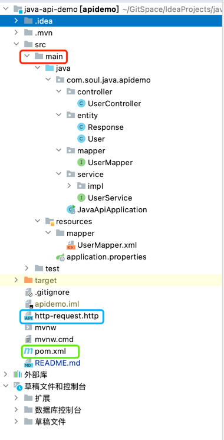

# java-api-demo
通过从零开始创建一个SpringBoot项目，学习编写Java Server项目。

## 目标
1. 完成一个基本类型的GET请求：

- [x] ```/hello```不含参数 ; 直接返回字符串 Hello World
- [x] ```/hello?name=Soul```含参数 ; 返回 Hello Soul 


2. 完成一个带有对象的GET请求： 
- [x] ```/addUserItem``` 在内部生成一个User对象，通过Map作为参数传给服务端
- [x] ```/getUserItem``` 获取一个固定的User对象，返回值为Map，客户端可映射成Object

3. 完成一个带有SQL交互的POST请求
- [x] ```/register``` 完成数据校验并Insert至数据库中  
- [ ] ```/login``` 从数据库中Select相关数据并校验


## 心得笔记


整体采用ORM结构设计。

代码主要存在于main文件夹，文件层级以.分割即为包名。

Contorller：负责提供对外接口，以 @RequestMapping注解的形式提供，调用Service方法实现。

Service：负责具体业务实现，如判断参数等；包含UserService(接口)和UserServiceImp（实现）。

Entity：实体，即为Model；描述对象的数据结构。

Mapper：与数据库进行交互，包含UserMapper.json(类)和UserMapper.xml(映射，类似iOS的xib)；数据库的配置在application.properties中；xml文件通过jdbc连接串连接数据库。


此外，http-requesr.http提供了模拟Http请求的功能，便于收集response数据，类似postman；pom.xml管理三方库依赖，类似cocoapods的podfile。


